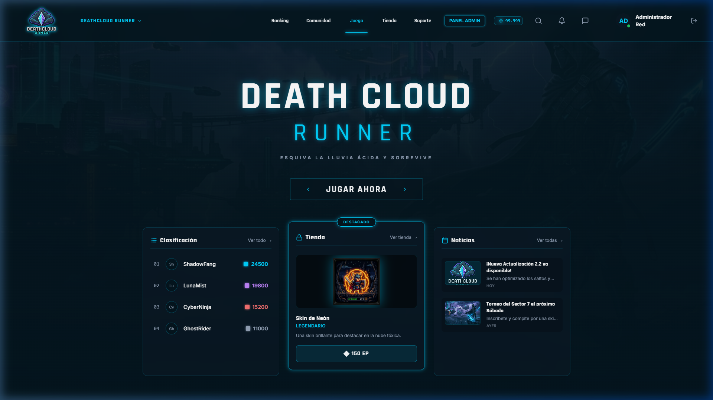
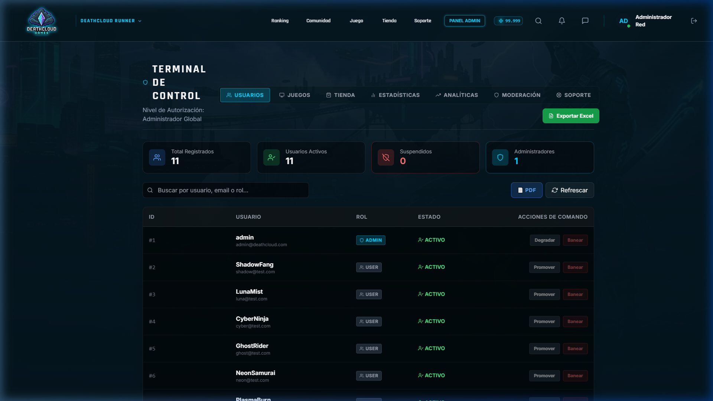

# 🚀 DEATHCLOUD - Ecosistema de Distribución de Videojuegos

[](https://react.dev)
[](https://nodejs.org)
[](https://www.postgresql.org)
[](https://socket.io)
[](https://opensource.org/licenses/MIT)

**DeathCloud** es una plataforma web para la distribución de videojuegos en línea, gestión de perfiles de sobrevivientes en entornos post-apocalípticos, mensajería en vivo en el lobby, soporte técnico mediante tickets e inventarios de skins adquiridos con créditos de la plataforma.

> [!NOTE]
> Este repositorio corresponde a una versión demostrativa del proyecto original. La aplicación fue adaptada para ejecutarse completamente en el navegador mediante una capa de simulación local, permitiendo probar la experiencia sin desplegar servidores, bases de datos o servicios externos. El objetivo es facilitar su evaluación como proyecto de portafolio preservando el comportamiento funcional de la aplicación.

---

## 🎨 Capturas de Pantalla (Vistas Clave)

### Dashboard del Jugador


### Panel de Control Administrativo


---

## 🔗 Enlaces del Proyecto

*   🚀 **[Probar Demo en Vivo (GitHub Pages)](https://Tebias-cloud.github.io/DeathCloud/)**
*   🌐 **[Repositorio Frontend (React / Vite)](./deathcloud-frontend)**
*   ⚙️ **[Repositorio Backend (Node.js / Express)](./deathcloud-backend)**
*   🗃️ **[Repositorio Base de Datos (PostgreSQL)](./deathcloud-database)**

---

## 🏛️ Contexto del Proyecto

El proyecto nació originalmente como una aplicación universitaria de tres capas con bases de datos PostgreSQL reales en red y servidores Socket.io. Debido a que las bases de datos de producción residían en una VPN interna y privada del campus, era inviable desplegar el backend de manera pública en la nube sin incurrir en costos de mantenimiento.

Para poder exhibir este desarrollo de forma libre y ligera ante reclutadores y entusiastas, decidí **desacoplar completamente el frontend de la infraestructura física del servidor**. Diseñé un adaptador síncrono e inyectable que emula la API REST, la persistencia relacional en memoria y el flujo de comunicación WebSocket directamente en el navegador del cliente. Esto demuestra flexibilidad de diseño, dominio del desacoplamiento de software y adaptación de código para diferentes entornos de ejecución.

---

## ⚙️ Arquitectura Original vs. Capa de Simulación

Para lograr una ejecución 100% serverless sin sacrificar ninguna de las funcionalidades del negocio, se diseñó la siguiente correspondencia de capas:

| Capa / Servicio | Arquitectura Original (Servidor) | Capa de Simulación Local (Navegador) |
| :--- | :--- | :--- |
| **Base de Datos** | PostgreSQL (Relaciones, claves foráneas, JSONB). | `localStorage` + `browserDb.js` (Simula el motor relacional e inicializa semillas). |
| **Llamadas API** | REST API en Node.js / Express. | Interceptor síncrono en `fetchMock.js` que desvía peticiones `/api` al mock. |
| **Tiempo Real** | WebSocket mediante `socket.io-client`. | Alias en Vite hacia `socketMock.js` que emula sockets e incluye chatbots. |
| **Archivos** | Almacenamiento local en disco proxificado por Nginx. | Conversión en base64 (`FileReader`) y almacenamiento en base de datos local. |
| **Enrutado** | `BrowserRouter` (React Router). | `HashRouter` (Evita errores 404 en servidores estáticos sin redirecciones). |

---

## 🕹️ Funcionalidades Disponibles en la Demo

Puedes probar e interactuar con el flujo de negocio completo directamente desde la demo en vivo:

1.  **Lobby Social y Chat en Vivo:** Envío de mensajes en tiempo real en la sala global y mensajería privada interactiva con respuestas inteligentes de chatbots (simulando amigos conectados).
2.  **Catálogo Dinámico y Tematización:** Cambio dinámico de juego activo en el Hub. Lee los temas definidos en el JSONB del catálogo local y aplica los colores, contrastes y glows directamente al DOM.
3.  **Tienda de Skins y Aspectos:** Compra skins y complementos usando E-Points. El inventario se actualiza y bloquea el botón si no posees saldo suficiente.
4.  **Perfil del Jugador:** Gestión de la biografía, cambio de DeathCloud ID, selección y equipamiento de skins compradas, y monitorización de las sesiones de seguridad activas del usuario.
5.  **Sistema de Tickets:** Creación de tickets de soporte técnico clasificados por tipo e historial interactivo.
6.  **Panel de Control Administrativo (Admin):**
    *   **Gestión:** Modera usuarios (banear o cambiar roles), crea o edita juegos en el catálogo, añade noticias y crea ítems para la tienda.
    *   **Reportes BI (Analíticas):** Monitoreo de actividad de la comunidad, descargas de informes estructurados en PDF (con capturas dinámicas) y archivos tabulares de Excel generados en tiempo real.
7.  **Launcher Virtual:** Simulación de descarga del launcher con barra de progreso interactiva que descarga un archivo mock.

---

## 🔑 Credenciales de Prueba

Para probar todas las vistas (incluidas las de administración), puedes usar las siguientes cuentas precargadas en el sistema local:

### 👤 Cuenta de Usuario Normal
*   **Correo:** `shadow@test.com` (o Nombre de usuario: `ShadowFang`)
*   **Contraseña:** `player123`

### 🛠️ Cuenta de Administrador de Red
*   **Correo:** `admin@deathcloud.com` (o Nombre de usuario: `admin`)
*   **Contraseña:** `admin123`

---

## 🛠️ Cómo Ejecutar en Local

Si deseas clonar el repositorio y ejecutar la aplicación frontend en tu computadora:

1.  Navega al directorio del frontend:
    ```bash
    cd deathcloud-frontend
    ```
2.  Instala las dependencias necesarias:
    ```bash
    npm install
    ```
3.  Inicia el servidor de desarrollo local de Vite:
    ```bash
    npm run dev
    ```
4.  Para compilar y empaquetar para producción:
    ```bash
    npm run build
    ```
5.  Para previsualizar localmente el build de producción generado:
    ```bash
    npm run preview
    ```

---

## ⚠️ Limitaciones de la Demo Estática

*   **Persistencia Local:** Toda la información creada o modificada se guarda en el almacenamiento local de tu navegador (`localStorage`). Si borras los datos de navegación o usas una pestaña de incógnito, la base de datos se reiniciará a sus valores de fábrica.
*   **Infraestructura:** La lógica simulada está diseñada exclusivamente para mostrar la interactividad del frontend. No contiene las protecciones de seguridad reales del backend original ni almacenamiento persistente centralizado en la nube.

---

## 👤 Autor

**Esteban Vidal**
*   🐙 **[GitHub](https://github.com/Tebias-cloud)**
*   💼 **[LinkedIn](https://www.linkedin.com/in/esteban-vidal-dev/)**
*   💻 **[Portafolio Web](https://esteban-vidal.vercel.app/)**
