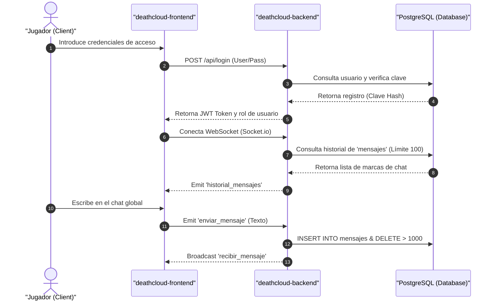

# 🚀 DeathCloud - Ecosistema Consolidado de Distribución de Videojuegos

Este repositorio consolidado reúne las tres capas que componen la plataforma **DeathCloud**: el cliente web, el servidor backend y los esquemas de base de datos. El sistema está diseñado para la distribución de videojuegos, gestión de perfiles de usuario, mensajería en vivo en el lobby, soporte técnico mediante tickets e inventarios de aspectos (skins) adquiridos con créditos de la plataforma.

---

## 🏛️ Estructura del Ecosistema

El sistema se compone de tres módulos independientes que interactúan en red:

1.  **[deathcloud-frontend/](./deathcloud-frontend)**: Cliente SPA construido con **React.js**, **Vite** y **Tailwind CSS / Vanilla CSS**.
2.  **[deathcloud-backend/](./deathcloud-backend)**: API REST y servidor de WebSockets desarrollado con **Node.js**, **Express** y **Socket.io**.
3.  **[deathcloud-database/](./deathcloud-database)**: Scripts de inicialización, seeds de demostración y migración para bases de datos **PostgreSQL**.

---

## 📡 Arquitectura de Comunicación y Flujo de Datos

La comunicación entre componentes se realiza a través de llamadas a la API REST (para consultas generales y de sesión) y WebSockets (para las comunicaciones en tiempo real del lobby).

---

## ⚙️ Estado Actual del Proyecto y Dependencias Legacy

*   **Infraestructura Original:** El sistema fue diseñado y ejecutado en producción sobre un servidor PostgreSQL local de la universidad, accesible a través de una VPN.
*   **Credenciales y Hosts Legacy:**
    *   El backend apunta al host `192.168.50.24` (IP privada del servidor universitario) en sus configuraciones de desarrollo y producción.
    *   El frontend en producción está preconfigurado para realizar peticiones HTTP a la dirección `http://192.168.50.24/api`.
*   **Mecanismo de Contingencia Activo:** Al no estar operativo dicho servidor universitario, el backend activa automáticamente el **modo local de simulación** (`isLocalMockMode`), permitiendo que el servidor arranque y responda las peticiones de los controladores en memoria. Sin embargo, el catálogo de juegos (`catalogController.js`) tiene hardcodeada la conexión a la base de datos `death_cloud_prod`, lo que arroja errores 500 al consultar `/api/catalog/games` si no hay un servidor Postgres levantado localmente.

---

## 📂 Repositorios del Ecosistema

Para conocer en detalle la implementación, instalación e informes de calidad independientes de cada módulo, accede a sus directorios específicos:

*   🌐 **[Frontend (React / Vite)](file:///c:/Users/Esteban/Desktop/proyectosT/deathcloud-frontend/README.md):** SPA con dashboards de jugador, tienda de skins, chat en vivo y paneles administrativos.
    *   📄 [Reporte de Auditoría de Frontend (REVIEW_REPORT.md)](file:///c:/Users/Esteban/Desktop/proyectosT/deathcloud-frontend/REVIEW_REPORT.md)
*   ⚙️ **[Backend (Node.js / WebSockets)](file:///c:/Users/Esteban/Desktop/proyectosT/deathcloud-backend/README.md):** Servidor API y WebSockets con sistema de contingencia ante caída de base de datos.
    *   📄 [Reporte de Auditoría de Backend (REVIEW_REPORT.md)](file:///c:/Users/Esteban/Desktop/proyectosT/deathcloud-backend/REVIEW_REPORT.md)
*   🗃️ **[Database (PostgreSQL)](file:///c:/Users/Esteban/Desktop/proyectosT/deathcloud-database/README.md):** DDL y scripts de siembra estructural segmentados por esquemas independientes.
    *   📄 [Reporte de Auditoría de Base de Datos (REVIEW_REPORT.md)](file:///c:/Users/Esteban/Desktop/proyectosT/deathcloud-database/REVIEW_REPORT.md)

---

## 📝 Informe de Auditoría del Monorepo Consolidado

Consulta la evaluación técnica global y deudas de integración del proyecto consolidado:
📄 **[Reporte de Revisión Global de DeathCloud (REVIEW_REPORT.md)](file:///c:/Users/Esteban/Desktop/proyectosT/DeathCloud/REVIEW_REPORT.md)**

---

## 📄 Licencia
Este ecosistema de proyectos se distribuye bajo la Licencia **MIT**.
